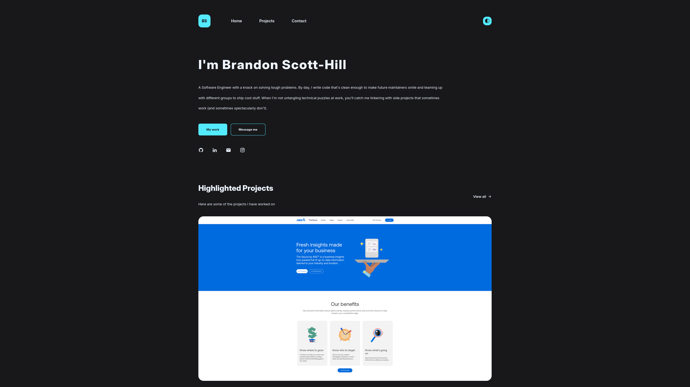

# Brandon Scott-Hill Personal Website - https://b-ran.dev

This is a personal portfolio website built with Svelte 5 and SvelteKit.



## Features

- 🌓 Dark/Light theme toggle with system preference detection
- 📱 Fully responsive design for mobile, tablet, and desktop
- 🚀 Fast performance with SvelteKit
- 📧 Contact form with SendGrid integration
- 📊 Project showcase
- 🔍 Error tracking with Sentry

## Tech Stack

- **Frontend Framework**: [Svelte 5](https://svelte.dev/) with [SvelteKit](https://kit.svelte.dev/)
- **Styling**: [TailwindCSS 4](https://tailwindcss.com/)
- **Deployment**: [Vercel](https://vercel.com/)
- **Error Tracking**: [Sentry](https://sentry.io/)
- **Email**: [SendGrid](https://sendgrid.com/)

## Getting Started

### Prerequisites

- [Node.js](https://nodejs.org/) (v18 or later recommended)
- [Yarn](https://yarnpkg.com/) (v1.22 or later)

### Environment Variables

Create a `.env` file in the root directory with the following variables:

```
SENDGRID_API_KEY=your_sendgrid_api_key
SENDGRID_EMAIL=your_email@example.com
```

### Installation

1. Clone the repository
   ```bash
   git clone https://github.com/b-ran/b-ran.dev.git
   cd b-ran.dev
   ```

2. Install dependencies
   ```bash
   yarn install
   ```

3. Start the development server
   ```bash
   yarn dev
   ```

4. Open your browser and navigate to `http://localhost:5173`


## Deployment

This project is configured to deploy to Vercel by merging with the `main` production deployments are automatically triggered.
